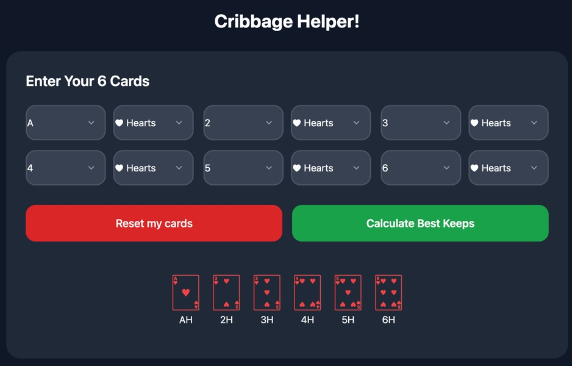

# Cribbage Helper! 🃏

Use it for free at: [https://lucidindian.github.io/cribbage-helper/](https://lucidindian.github.io/cribbage-helper/)

A simple, powerful cribbage hand analyzer that helps you choose the **best 4 cards to keep** by calculating the **true expected value (EV)** for every possible keep.

Perfect for practicing or using discreetly during family games! I made this to prove to my mom (an expert player) that making mathematically superior decisions over time will result in more wins and by greater margins. My early interaction with this tool has revealed to myself that I underestimate the scoring ability of keeping open-ended straghts-to-be or keeping open to possibilities at several levels of play (pegging, counting hand, crib) rather than maximize the score in only one phase (counting hand). I can now easily tell if I lost due to poor cuts, especiallyw when I run into a stretch where the cut reveals a score consistently lower than the expected value; unlucky streaks don't last forever. I once had AA vs. and AQ in Hold'em and I lost because my opponenent hit two queens after going all-in pre-flop; it happens, but I still made the right call, to go all-in. I see it's the same with cribbage. Making the right decision does not always result in the best score in a single game, but if played a thoussand or a million times, I'd consistently come out on top as long as I'm making decisions that result in the highest scores based on the cards remaining in the deck. My plan is to play with this tool until I can "feel" which decisions to make, then I may continue on as a mathematically better cribbage player. 

### Features

- **Manual card entry** – Select your exact 6 cards using easy dropdowns (no more random deals)
- Calculates **expected points** for all 15 possible 4-card combinations and shows the top choices
- Simulates **all 46 possible cut cards** for accurate EV
- Full standard cribbage scoring:
  - 15s (2 points each)
  - Pairs, runs (of any length), flushes (4 or 5 cards)
  - Nobs
- Instantly shows the **best keep(s)** sorted by highest Expected Value
- Play mode: Enter cut card manually to see exact score + breakdown
- Live game score tracker
- 100% client-side – works offline after loading
- Hosted for **free on GitHub Pages**

### How to Use

1. Open the app: [https://yourusername.github.io/cribbage-helper](https://lucidindian.github.io/cribbage-helper/)
2. Use the dropdowns to enter the **6 cards** in your hand
3. Click **"Calculate Best Keeps"**
4. Review the list – the top option is mathematically the best keep
5. Click any row to enter **Play Mode**
6. Type a cut card manually to see how many points you actually score
7. Keep track of your running score against your opponent

### Technologies

- HTML + CSS + JavaScript
- Tailwind CSS (via CDN)
- Unicode playing card symbols
- No backend, no dependencies, no build step required
- Fully static – perfect for GitHub Pages

### Future Ideas

- Prevent duplicate card selection
- Card card indicator ( is it better or worse than EV and how rare? - cut card can make or break a hand)
- Phone camera vision for instant hand recognition (takes a long time to manually enter 6 cards + suits)
- "Random Deal" button for practice
- Hand-ranking improvements:
  -- Crib considerations: scoring x who's crib?
  -- Pegging phase considerations 
  -- Pegging phase helper
- 5 card game mode (for 3 players)
- Dark/light mode toggle

### Contributing

Feel free to make a pull request or fork and improve! This was built to help me consistently beat my mom at cribbage.

---

**Made with ❤️ for casual cribbage players who want to win.**
